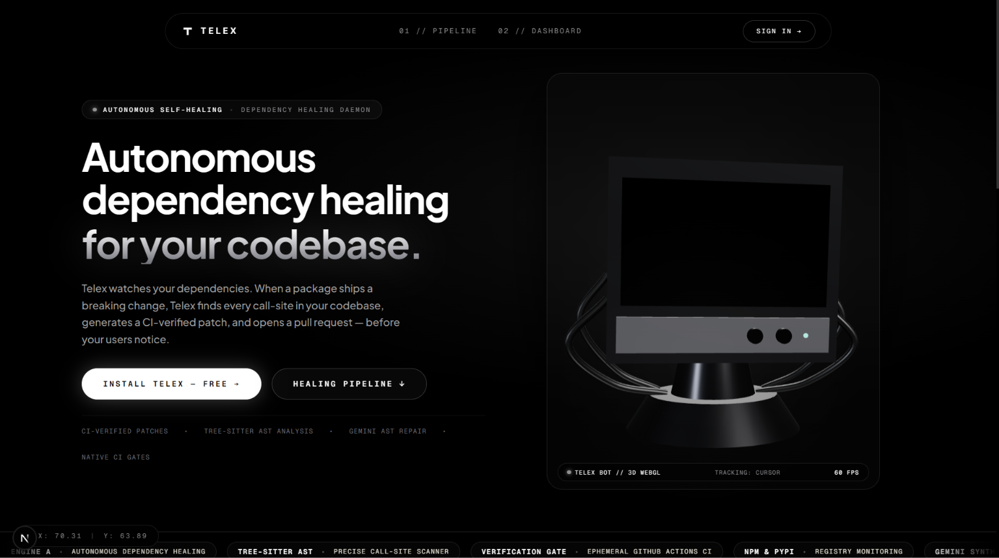

<div align="center">
  
  <h1>Telex</h1>
  <p><b>Autonomous dependency self-healing for production codebases.</b></p>
  <p>
    Watches npm &amp; PyPI · AST-scans affected repos · Generates LLM patches ·<br>
    Verifies in ephemeral CI sandboxes · Opens human-reviewed pull requests.
  </p>

  [](https://github.com/Kesavaraja67/telex/actions/workflows/ci.yml)
  [](https://github.com/Kesavaraja67/telex/actions)
  [](ARCHITECTURE.md)

  <br><br>
  

</div>

---

## The problem

When `axios@1.8.0` drops a breaking API change at 3 AM, your CI breaks in the morning, an engineer spends 2 hours on git-blame archaeology, and the fix is usually a 4-line change.

**Telex handles the 4-line change.** Before your engineers get to work.

---

## How it works

```
npm / PyPI registry
       │
       ▼  poll_registry  (every 15 min)
Detect new version  ──→  extract_changes  (LLM parses breaking symbols from changelog)
                                │
                                ▼  scan_repo  (Tree-Sitter AST)
                         Find affected call sites  ──→  TypeScript · TSX · JS · Python
                                │
                                ▼  generate_patch  (Best-of-3 LLM candidates)
                         Structural check + real git apply → smallest passing diff
                                │
                                ▼  validate_patch  (ephemeral GitHub Actions sandbox)
                         Repo's own test suite + typecheck gate
                                │
                                ▼  open_pr  (GitHub Pull Request + Check Run)
                         Verification receipt in body  ·  "Telex Validation" check
                         Never auto-merges — a human reviews and merges
```

Every stage is a Postgres-backed async job with `SELECT … FOR UPDATE SKIP LOCKED`, exponential backoff, heartbeat leases, and per-installation fairness caps.

---

## What's different

| | Naive approach | Telex |
|---|---|---|
| **Change detection** | Grep changelogs | LLM-structured breaking symbol extraction |
| **Usage search** | `grep -r 'symbol'` | Tree-Sitter AST — zero false positives from comments or strings |
| **Patch quality** | Single LLM call | Best-of-3 candidates → `git apply` filter → smallest valid diff |
| **Verification** | "runs locally" | Ephemeral sandbox running the **repo's own test suite** on the actual patch |
| **PR transparency** | Generic "AI fix" | Explicit `verification_mode` + gate evidence in every PR body |
| **Multi-tenancy** | Global FIFO | Per-installation cap — one high-volume org can't starve others |
| **LLM provider** | One hardcoded key | BYOK for 10 providers · Fernet-encrypted at rest · Gemini fallback |

---

## LLM Providers

Telex ships with 10 provider implementations. Bring your own key in Settings — or use the platform's hosted Gemini with zero configuration.

| Provider | Default model |
|---|---|
| Google Gemini *(platform default)* | `gemini-2.5-flash` |
| OpenAI | `gpt-4o-mini` |
| Anthropic Claude | `claude-sonnet-4-5` |
| Mistral AI | `mistral-small-latest` |
| Groq | `llama-3.3-70b-versatile` |
| Cohere | `command-r-plus-08-2024` |
| xAI Grok | `grok-3-mini` |
| DeepSeek | `deepseek-chat` |
| Together AI | `llama-3.3-70B-Instruct-Turbo` |
| Nvidia Nemotron | `llama-3.1-nemotron-70b-instruct` |

---

## Security

- **BYOK keys**: Fernet-encrypted at rest. Plaintext only in memory during the `POST /api/settings/api-keys` handler. Never stored, never logged, never returned after save.
- **Log redaction**: Global filter on the root logger strips `sk-*`, `AIza*`, `sk-ant-*`, and 40+ character tokens from every log line before emission.
- **Webhooks**: HMAC-SHA256 (`X-Hub-Signature-256`) verified before any payload processing.
- **Sessions**: Cross-origin `/api/auth/me` with HttpOnly JWT cookies — no `document.cookie` cross-domain hacks.
- **CI**: `pip-audit` (Python) + `npm audit` (Node) + Gitleaks secret scanning on every push and PR.
- **No automerge**: At any confidence level. Ever. Not configurable. By design.

---

## Stack

**Backend** — FastAPI · SQLAlchemy 2 async · PostgreSQL 15 · Alembic · APScheduler · PyGithub · Tree-Sitter 0.21 · cryptography (Fernet) · python-jose

**Frontend** — Next.js 16 (App Router) · TypeScript strict · Vanilla CSS

---

## Local setup

```bash
# Clone
git clone https://github.com/Kesavaraja67/telex.git
cd telex

# Backend
cp .env.example apps/api/.env
# → fill in GITHUB_APP_ID, GITHUB_APP_PRIVATE_KEY, GEMINI_API_KEY, DATABASE_URL

# Generate BYOK encryption key (required)
python -c "from cryptography.fernet import Fernet; print(Fernet.generate_key().decode())"
# → paste output as TELEX_ENCRYPTION_KEY in apps/api/.env

cd apps/api
python -m venv venv && source venv/bin/activate
pip install -r requirements.txt
alembic upgrade head
uvicorn main:app --reload --port 8000

# Frontend (separate terminal)
cd apps/web
npm install && npm run dev
# → http://localhost:3000/dashboard
```

---

## Tests

```bash
cd apps/api && pytest -v
# 26/26 passing
```

| Suite | Tests | Coverage |
|---|---|---|
| `test_code_scanner.py` | 7 | AST scanning across TS, TSX, JS, Python |
| `test_patch_generation.py` | 11 | Best-of-N, micro-apply, sandbox gate |
| `test_validate_patch.py` | 5 | Verification modes, disclosure, gating |
| `test_webhooks.py` | 3 | PR merged / closed / reopened lifecycle |

---

## Repository layout

```
apps/api/
  alembic/versions/     9 migrations (schema history preserved)
  db/models.py          User, Installation, Repo, Patch, ValidationRun, UserApiKey, …
  jobs/handlers/        poll_registry · extract_changes · scan_repo · generate_patch · validate_patch · open_pr
  jobs/queue.py         SKIP LOCKED + per-installation fairness cap
  routers/              auth · repos · packages · webhooks · stats · settings (BYOK)
  services/
    code_scanner.py     Tree-Sitter AST (TS, TSX, JS, Python)
    crypto.py           Fernet BYOK key encryption (single swappable _get_master_key)
    github_service.py   GitHub App: branches · PRs · Check Runs · rate-limit backoff
    patch_providers/    10 LLM implementations + BYOK-aware factory
  tests/                26 tests + real breaking-change benchmark fixtures

apps/web/app/dashboard/
  page.tsx              Telemetry overview
  repos/                Repo list · policy toggles · per-repo change/patch/PR detail
  settings/             BYOK key management (10 providers, live status)
  activity/             Cross-repo reverse-chronological event feed
```

---

<div align="center">
  <a href="ARCHITECTURE.md">Architecture</a> · <a href="DEMO.md">Evaluator Guide</a>
</div>
